# 콘텐츠 AI 소스 설정 및 관리

이 안내서는 사전 요구 사항 충족부터 콘텐츠 소스 만들기 및 색인화와 가용성 확인에 이르기까지 Cloud Manager에서 콘텐츠 AI 소스를 설정하는 방법을 안내합니다.

## 사전 요구 사항 {#prerequisites}

시작하기 전에 다음 조건이 충족되는지 확인하십시오.

* 하나 이상의 AEM as a Cloud Service 환경이 있는 활성 Cloud Manager 프로그램을 갖고 있습니다.
* 프로그램의 Admin Console에서 **[시스템 관리자](https://experienceleague.adobe.com/ko/docs/support-resources/adobe-support-tools-guide/adobe-admin-console/admin-roles)** 역할을 갖고 있습니다.
* **Adobe Admin Console**&#x200B;에서 환경 제품 프로필이 프로비저닝되었습니다. [Adobe Developer Console 프로젝트 설정](setup-adc-project.md)을 참조하십시오.

## 1단계 - 콘텐츠 AI 구성 탭 열기 {#open-tab}

1. [Cloud Manager](https://my.cloudmanager.adobe.com/)에 로그인하고 프로그램을 선택합니다.

   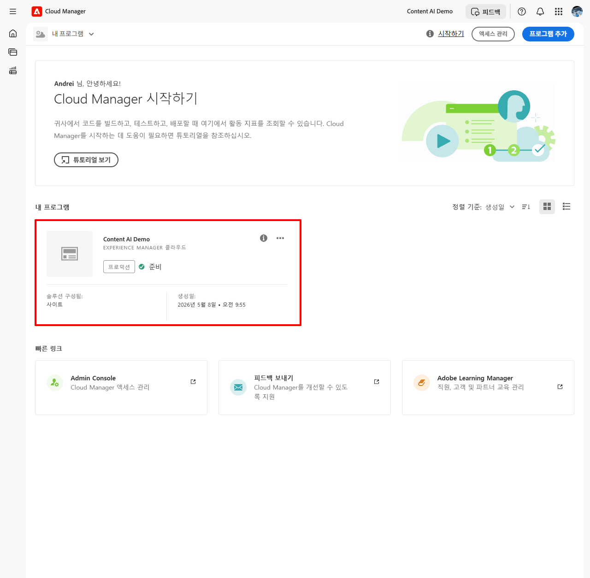

1. **[!UICONTROL 프로그램 개요]**&#x200B;에서 **[!UICONTROL 환경]** 섹션을 찾아 구성하려는 환경을 선택합니다.

   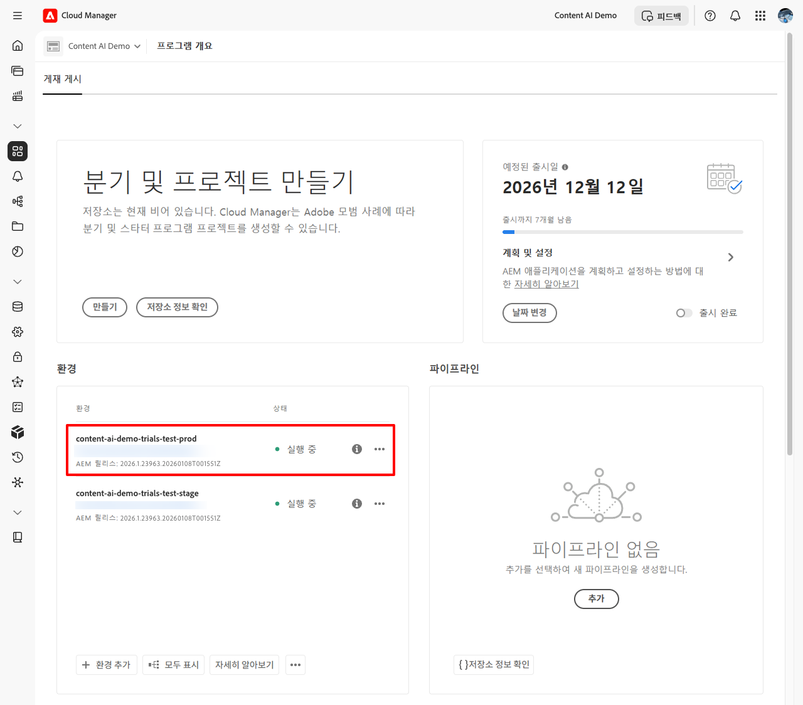

1. 환경 세부 정보 페이지에서 **[!UICONTROL 콘텐츠 AI 구성]** 탭을 선택합니다.

   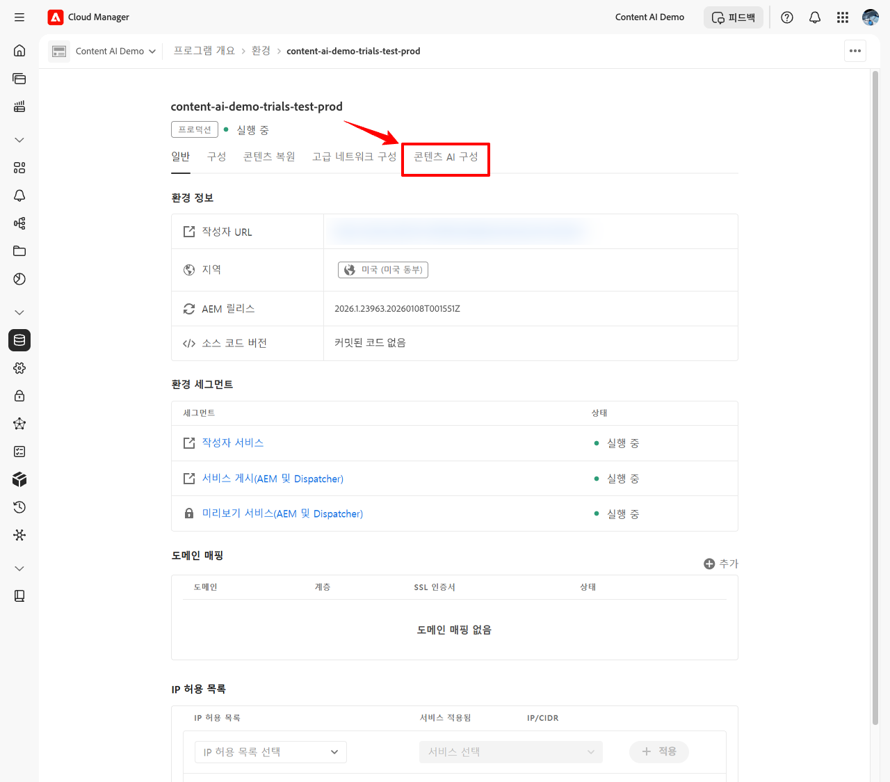

## 2단계 - 콘텐츠 AI 소스 만들기 {#create-source}

콘텐츠 소스는 콘텐츠 AI가 크롤 및 색인화할 웹 사이트를 정의합니다.

1. **[!UICONTROL 콘텐츠 AI 구성]** 탭에서 **[!UICONTROL 소스 만들기]**&#x200B;를 선택합니다.

   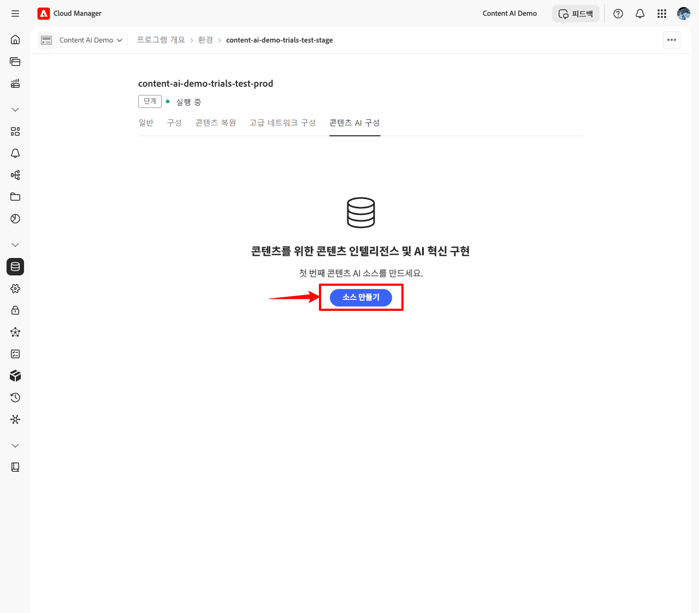

1. **[!UICONTROL 새 콘텐츠 AI 소스 만들기/추가]** 대화 상자에서 다음 필드를 채웁니다.

   | 필드 | 설명 |
   | --- | --- |
   | **[!UICONTROL 콘텐츠 AI 구성 이름]** | 이 소스의 고유 식별자입니다(예: `my-site-index`). 생성 후에는 변경할 수 없습니다. |
   | **[!UICONTROL 설명]** | *(선택 사항)* 콘텐츠 원본에 대한 간략한 설명입니다. |
   | **[!UICONTROL 웹 사이트 주소]** | 크롤할 웹 사이트의 루트 URL입니다(예: `https://www.example.com/`). |
   | **[!UICONTROL URL 제외]** | *(선택 사항)* 크롤하는 동안 건너뛸 URL 패턴입니다. |
   | **[!UICONTROL 새로 고침 빈도]** | 콘텐츠 AI가 소스를 다시 크롤하는 빈도: 매주, 매일 4×, 60분 또는 15분. |

   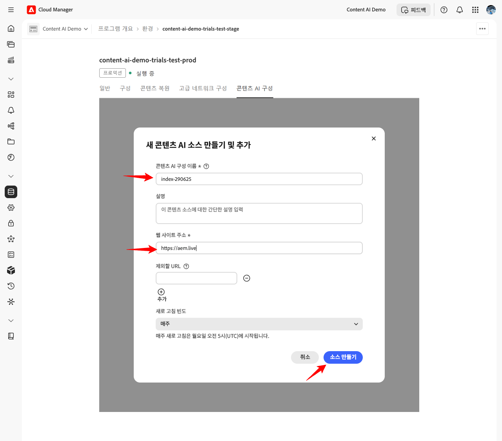

   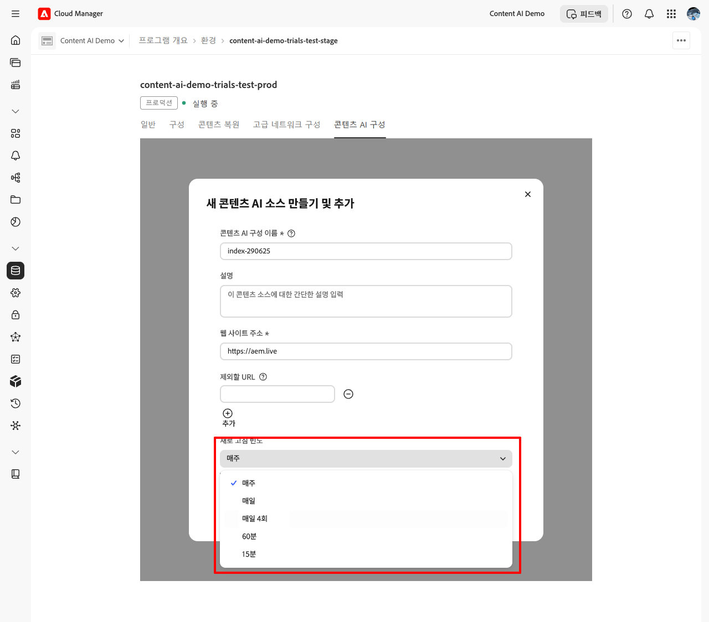

1. **[!UICONTROL 소스 만들기]**&#x200B;를 선택합니다.

## 3단계 - 획득 트리거 {#trigger-acquisition}

소스가 만들어진 후의 상태는 **신규**&#x200B;입니다. 초기 획득을 실행하여 색인화를 시작합니다.

1. 소스 목록에서 소스 옆에 있는 **추가 작업**(...) 아이콘을 선택한 다음 **[!UICONTROL 획득 트리거]**&#x200B;를 선택합니다.

   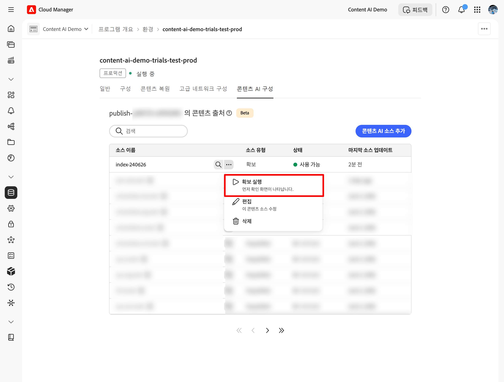

1. **[!UICONTROL 획득 트리거]** 대화 상자에서 소스 세부 사항(**[!UICONTROL 콘텐츠 소스]**, **[!UICONTROL 마지막 실행]** 및 **[!UICONTROL 다음 예약된 실행]**)을 검토하고 **[!UICONTROL 트리거]**&#x200B;를 선택합니다.

   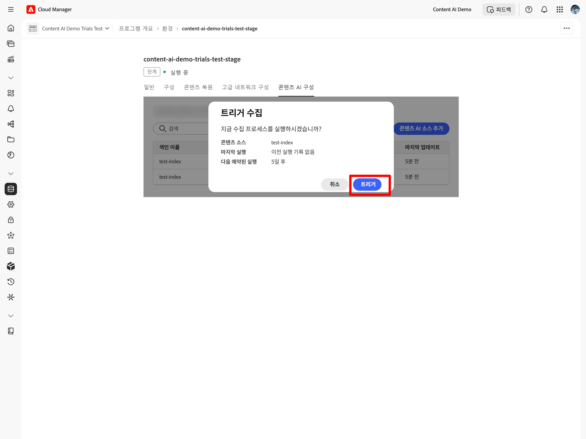

## 4단계 - 색인화 상태 모니터링 {#monitor-status}

획득이 시작되면 소스 상태가 실시간으로 업데이트됩니다.

| 상태 | 의미 |
| --- | --- |
| **신규** | 소스가 만들어졌으나 획득이 아직 실행되지 않았습니다. |
| **색인화** | 획득이 진행 중이며, 콘텐츠가 크롤 및 색인화되고 있습니다. |
| **사용 가능** | 색인화가 완료되었습니다. 소스에서 검색 쿼리를 수행할 준비가 되었습니다. |

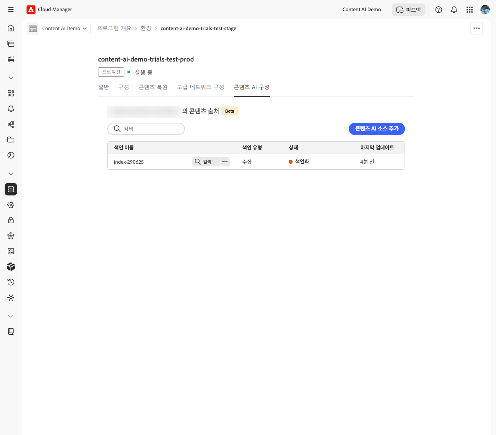

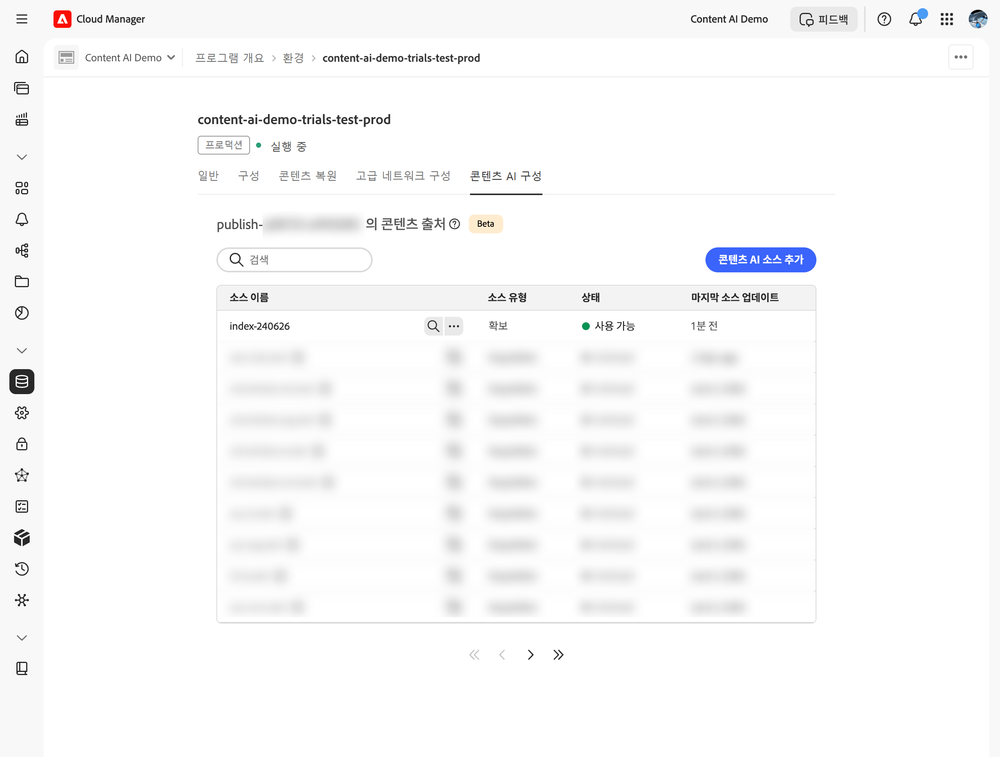

색인을 검색하거나 API를 테스트하기 전에 상태가 **사용 가능**&#x200B;이 될 때까지 기다립니다.

## 5단계 - 색인화된 콘텐츠 검색 {#search-content}

소스 상태가 **사용 가능**&#x200B;이면 Cloud Manager에서 직접 검색 쿼리를 실행하여 콘텐츠가 올바르게 색인화되었는지 확인할 수 있습니다.

1. 소스 목록에서 소스 옆에 있는 **[!UICONTROL 검색]**&#x200B;을 선택합니다.

   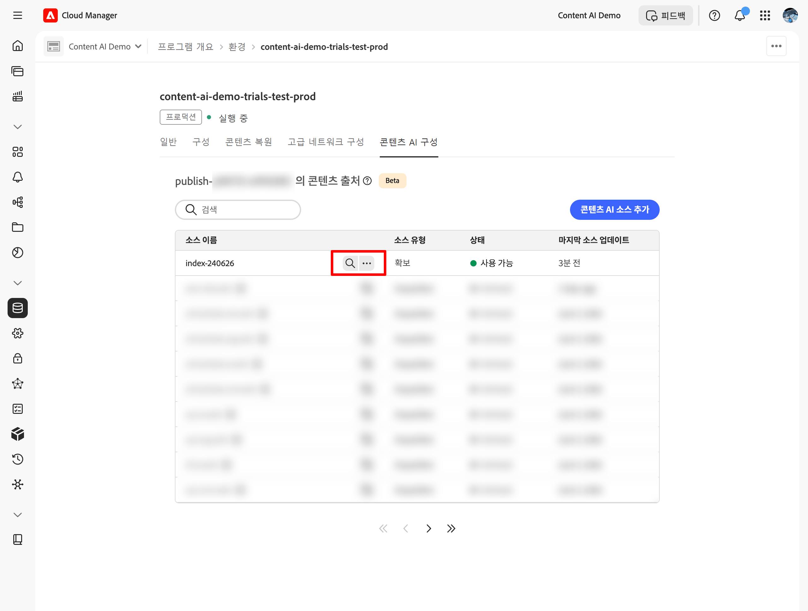

1. 검색 필드에 쿼리를 입력합니다. 일치 점수 및 콘텐츠 유형이 포함된 일치 항목의 목록이 표시됩니다(예: **PAGE** 또는 **PDF**). 결과를 선택하면 오른쪽에 미리보기가 열립니다.

   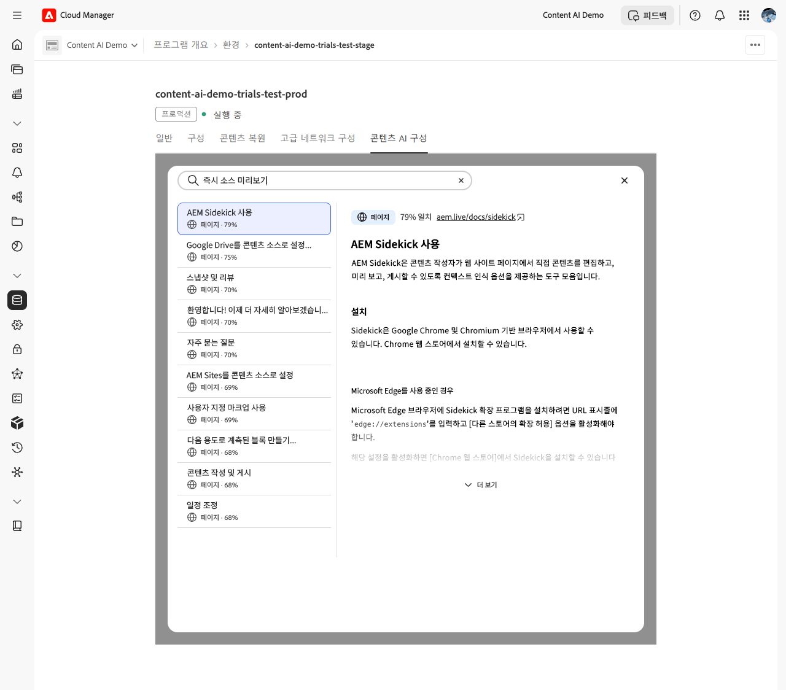

## 소스 수정 또는 삭제 {#modify-source}

소스 구성을 만든 후 업데이트하려면 다음을 수행하십시오.

1. 소스 목록에서 소스 옆에 있는 **추가 작업**(...) 아이콘을 선택한 다음 **[!UICONTROL 편집]**&#x200B;을 선택합니다.

   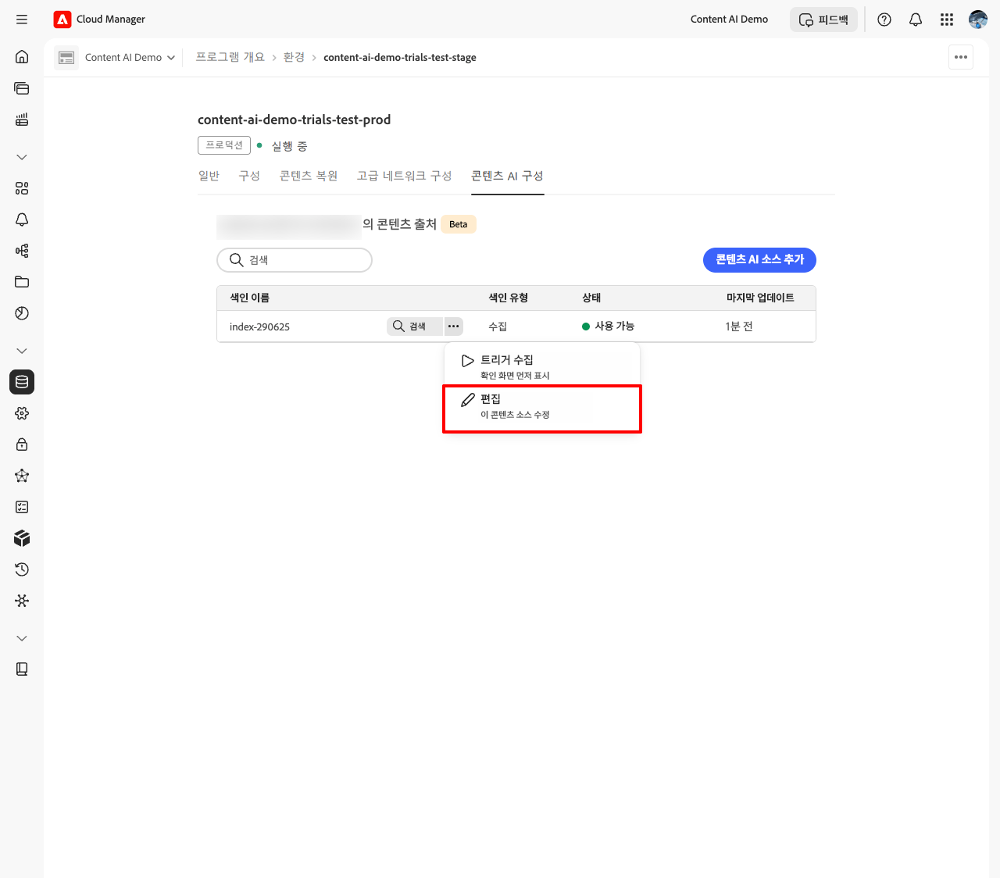

1. **[!UICONTROL 콘텐츠 AI 소스 수정]** 대화 상자에서 필요에 따라 **[!UICONTROL 설명]**, **[!UICONTROL 웹 사이트 주소]**, **[!UICONTROL URL 제외]** 또는 **[!UICONTROL 새로 고침 빈도]**&#x200B;를 업데이트합니다. **[!UICONTROL 콘텐츠 AI 구성 이름]**&#x200B;은 읽기 전용이므로 변경할 수 없습니다.

1. **[!UICONTROL 저장]**&#x200B;을 선택하여 변경 내용을 적용하거나 대화 상자의 왼쪽 하단에서 **[!UICONTROL 삭제]**&#x200B;를 선택하여 소스를 완전히 제거하십시오.

   >[!WARNING]
   >
   >소스 삭제는 되돌릴 수 없습니다. 해당 소스에 대해 색인화된 모든 콘텐츠가 제거되어 더 이상 검색 쿼리를 수행할 수 없습니다.

   편집 가능한 필드가 강조 표시되고 왼쪽 하단에 삭제 버튼이 있는 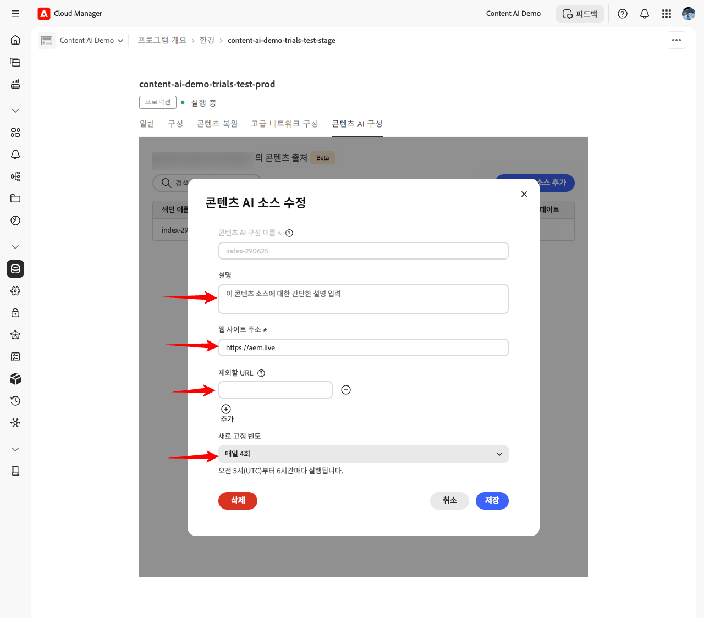

소스 목록이 업데이트되어 변경 사항이 반영됩니다. 소스를 삭제하면 더 이상 목록에 나타나지 않습니다.

## 다음 단계 {#next-steps}

* [Adobe Developer Console 프로젝트 설정](setup-adc-project.md) - API를 호출하는 데 필요한 ADC 프로젝트와 자격 증명을 만듭니다.
* [콘텐츠 AI API 참조](https://developer.adobe.com/experience-cloud/experience-manager-apis/api/experimental/contentai/) - 시맨틱, 전체 텍스트 또는 하이브리드 검색 엔드포인트를 사용하여 색인화된 콘텐츠를 쿼리합니다.

## 문제 해결 {#troubleshooting}

* **소스가 장기간 [!UICONTROL 색인화] 상태입니다.** (...) 메뉴에서 획득을 다시 시도하십시오. 두 번째 실행 후에도 상태가 나아지지 않으면 **[!UICONTROL 웹 사이트 주소]**&#x200B;에 공개적으로 연결할 수 있는지, **[!UICONTROL URL 제외]** 패턴이 모든 페이지를 필터링하지 않는지 확인하십시오.
* **실행 후에는 소스가 [!UICONTROL 신규]로 다시 이동합니다.** 웹 크롤러가 구성된 루트 URL에서 페이지를 가져오지 못했습니다. URL이 `200 OK`로 응답하고 사이트가 자동화된 요청을 차단하지 않는지 확인하십시오.
* **[!UICONTROL 검색]이 [!UICONTROL 사용 가능]한 소스에 대한 결과를 반환하지 않습니다.** 색인화에 성공했지만 쿼리와 일치하는 콘텐츠가 없습니다. 더 광범위한 쿼리를 시도하거나 기대하는 크롤 URL이 포함되어 있는지 확인하십시오.
