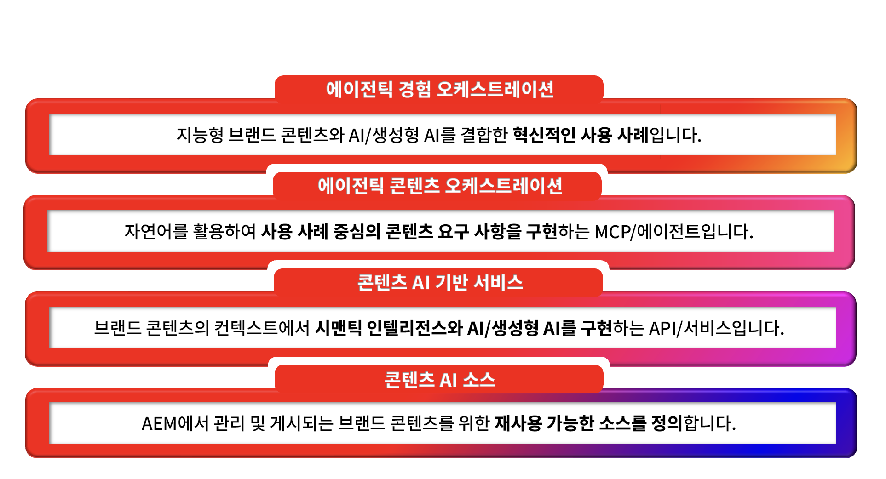

# AEM 콘텐츠 AI - 소개

## 지능형 콘텐츠, AI 지원 설계 {#ai-ready}

고객들은 웹 사이트를 만나기 전부터 AI를 통해 브랜드를 만나기 시작하고 있습니다. 채팅 도우미, AI 개요, 에이전트, 대화 검색, AI 컨시어지 등 모든 기능이 브랜드를 대신하여 브랜드 콘텐츠를 검색, 요약, 표시합니다. 그 내용은 연결할 수 있는 콘텐츠만큼만 정확하고 최신 상태이며 브랜드에 부합합니다.
이것이 바로 AEM 콘텐츠 AI에 구현된 변화입니다. 이 변화는 브랜드 콘텐츠를 AI 경험의 실행 기반이 되는 기본 진리로 취급하고, AEM 고객에게는 작성자 입장에서 이러한 기본 진리를 더 빨리 생성하고 게시 측면에서는 이를 소비자 중심의 AI 기반 환경에 깔끔하게 제공할 수 있는 도구를 제시합니다.

**작성자 측**&#x200B;에서 AEM 콘텐츠 AI는 승인된 브랜드 소스를 기반으로 생성을 수행합니다. AI 지원 작성, 기존 페이지 콘텐츠, 조각 및 에셋에 대한 자연어 검색, 브랜드 인식 세대를 통해 팀은 AEM을 종료하거나 이미 승인된 내용에서 벗어나지 않고도 새로운 대상자, 지역 및 채널에 대한 베리에이션을 만들 수 있습니다.

**게시 측**&#x200B;에서는 AI가 사용할 수 있도록 동일한 콘텐츠가 구조화되고 관리되며 주소 지정이 가능합니다. 조각, 메타데이터, 분류 및 승인된 소스는 검색 시스템, 에이전트 및 대화 인터페이스가 안심하고 사용할 수 있는 형태로 노출됩니다. 따라서 AI가 브랜드를 대변할 때는 브랜드의 진실을 대변하는 것입니다.

### AEM 고객에게 의미하는 것 {#what-it-means}

승인된 콘텐츠는 망상에 대한 브랜드의 방어기제입니다. AI가 관리되는 AEM 콘텐츠를 기반으로 한다면 기본적으로 답변은 정확하고 최신 상태를 유지하며 브랜드에 맞게 유지됩니다.
작성은 AI 시대의 요구에 부합합니다. 팀은 작성 환경 내에 있는 더 많은 대상자와 모먼트에 대한 복사 및 이미지를 생성합니다. 공백으로 시작하지 않고 승인된 소스에서 가져옵니다.
검색은 사람과 기계가 실제 물어보는 방식으로 작동합니다. 에셋, 조각, 페이지 및 양식에 대한 자연어 의도 기반 검색은 기존 콘텐츠를 재사용 가능한 공급 항목으로 바꿉니다.
개인 맞춤화는 복제가 아닌 재사용을 통해 확장됩니다. 관리되는 구성 요소는 추적되지 않은 사본으로 증식되지 않고 변형으로 재결합됩니다.
지금은 게시 채널에 AI 서피스가 포함됩니다. 콘텐츠는 각각에 대한 별도의 파이프라인 없이 인간, 에이전트 및 AI 매개 환경이 모두 소비할 수 있는 형태로 제공됩니다.

**더 큰 장점: 기존의 신뢰할 수 있는 브랜드 콘텐츠가 그 어느 때보다 더 큰 가치를 갖게 됩니다. AEM에 이미 존재하는 승인된 모든 조각, 에셋 및 페이지는 AI 기반 환경이 의존하는 기본 진리가 됩니다. 그리고 AEM 콘텐츠 AI는 이러한 라이브러리를 재사용 가능하고 검색 가능하며 다음에 나올 기능을 강화할 수 있게 만드는 요소입니다.**

## AEM 콘텐츠 AI 개요 {#at-a-glance}

AEM 콘텐츠 AI는 토대에 있는 신뢰할 수 있는 콘텐츠부터 최상위에서 제공하는 에이전트 환경에 이르기까지, 각 레이어를 단계별로 구축하는 4개 레이어 스택으로 구조화됩니다.

*스택을 토대가 되는 신뢰할 수 있는 콘텐츠부터 최상단의 에이전트 환경까지 아래에서 위로 읽으십시오.*

1. 콘텐츠 AI 소스
콘텐츠 소스는 신뢰할 수 있는 콘텐츠 본문에 연결하는 AEM 콘텐츠 AI의 관리형 엔티티입니다. 콘텐츠 소스는 에셋, 콘텐츠 조각, 페이지, 양식, 메타데이터, 분류 등과 같은 AEM에서 관리하는 콘텐츠 유형과 타사 웹 사이트, 기술 자료 또는 설명서 포털과 같은 비 AEM 소스를 참조할 수 있습니다. 각 콘텐츠 소스는 자동으로 벡터화되고, 의미적으로는 전력 검색, 접지 및 대화형 AI 환경으로 보강됩니다. 콘텐츠 소스를 한 번 정의하면 자동 새로 고침 및 업데이트 기능이 기본 제공되는 콘텐츠 AI API에서 재사용할 수 있습니다.

1. 콘텐츠 AI 기본 서비스
브랜드 콘텐츠 컨텍스트에서 시맨틱 인텔리전스 및 생성형 AI를 사용 가능하게 하는 API 및 서비스입니다. 콘텐츠 AI 소스 위에서 작동하는 이러한 서비스는 검색, 생성, 브랜드 인식 베리에이션, 최적화 등 모두 고객의 승인된 콘텐츠에 기반을 둔 기능을 제공합니다.

1. 에이전트 콘텐츠 오케스트레이션
사용 사례 중심의 콘텐츠 요구 사항을 자연어를 통해 조정된 작업으로 만드는 MCP 및 에이전트. 이 레이어를 이용하면 작성자와 다른 에이전트가 필요한 내용을 일반 언어로 설명하고 적절한 기본 서비스를 오케스트레이션하여 이를 수행할 수 있습니다.

1. 에이전트 환경 오케스트레이션
인텔리전트 브랜드 콘텐츠가 규모에 맞는 AI를 만날 때 나타나는 혁신적인 활용 사례입니다. AEM 솔루션 자체는 이러한 기본 서비스를 기반으로 구축되며, 고객은 동일한 API를 직접 사용하여 자체 콘텐츠 위에 자체 에이전트 환경을 구축할 수 있습니다. AI 기반 콘텐츠 공급망에서 대화형 사용자 여정에 이르기까지, 이 레이어에서는 관리되는 콘텐츠가 경쟁 우위가 됩니다.

이러한 레이어는 디자인에 의해 연결됩니다. 모든 AI 서비스는 콘텐츠 기반에서 나오며, 생성된 모든 것은 동일한 관리 시스템으로 다시 돌아갑니다. 따라서 작성자측 생성과 게시측 전달은 하나의 사실 소스를 공유합니다.

## AEM 콘텐츠 AI 활용 사례 {#action}

효과적인 콘텐츠 AI 통합에는 다음 두 가지 작업이 포함됩니다.

### &#x200B;1. AEM 환경에 맞는 콘텐츠 AI 사용 {#enable}

**전제 조건:** 콘텐츠 AI 사용을 시작하기 전에 AEM as a Cloud Service 환경에 맞는 API 자격 증명이 필요합니다. [Adobe Developer Console 프로젝트 설정](setup-adc-project.md)을 참조하십시오.

### &#x200B;2. 콘텐츠 AI 소스 제어 {#control}

콘텐츠 AI 소스를 설정 및 관리하여 AI 기반 환경을 활성화하십시오. 자세한 내용은 [콘텐츠 소스 제어](contentsources.md)를 참조하십시오.

## 콘텐츠 AI API 알아보기  {#apis}

AEM 콘텐츠 AI의 다양한 기능을 살펴보십시오. API는 플랫폼의 모든 잠재력을 보여줍니다. [콘텐츠 AI API](https://developer.adobe.com/experience-cloud/experience-manager-apis/api/experimental/contentai/)를 참조하십시오.
