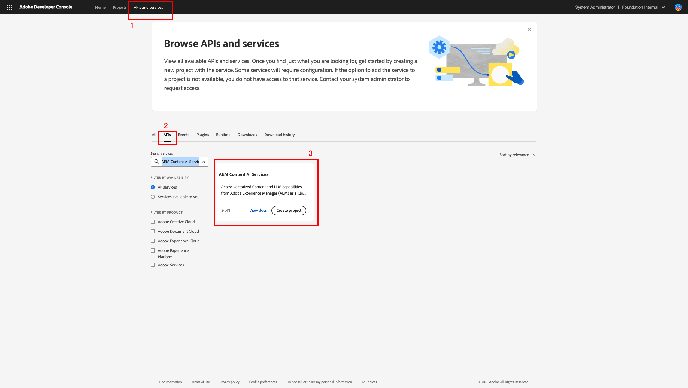
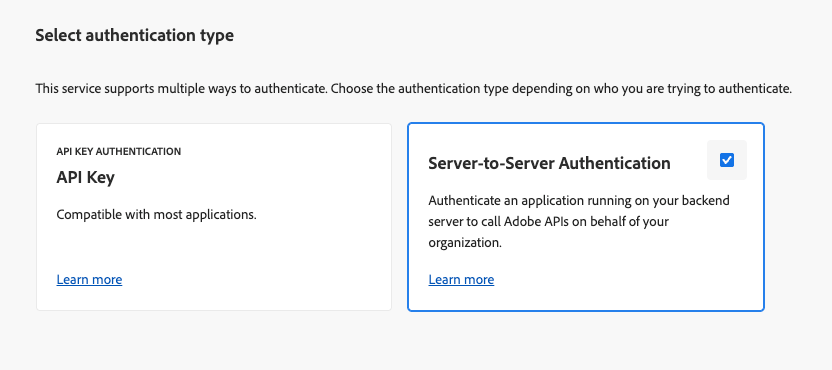
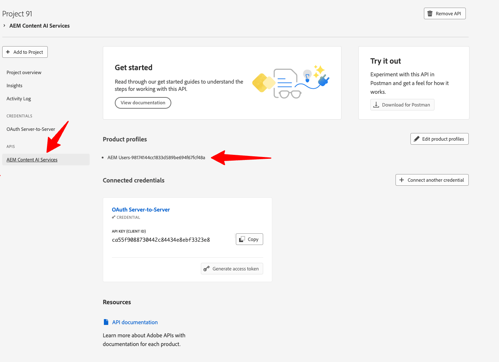
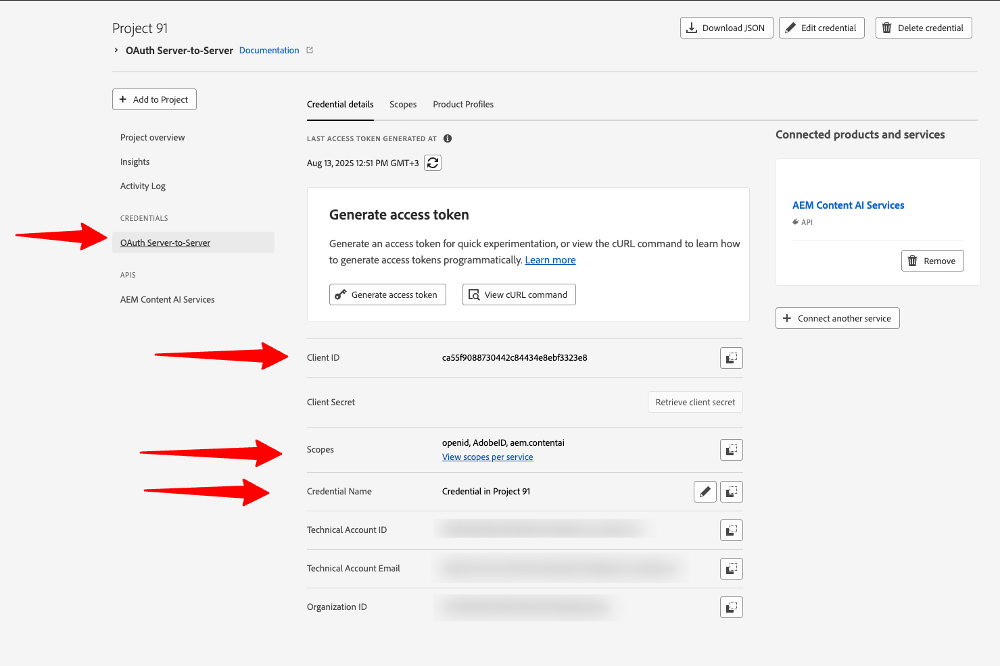
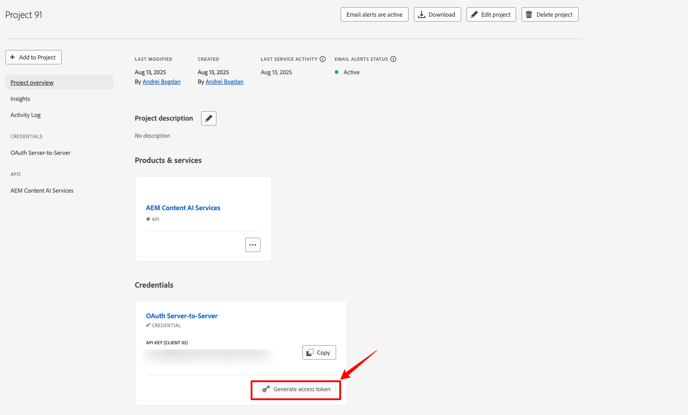
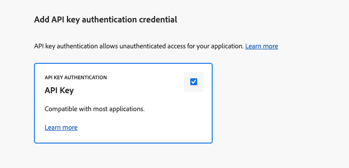

# Adobe Developer Console 프로젝트 설정 {#configure-adc-project}

AEM Content AI Services API를 호출하려면 Adobe Developer Console(ADC) 프로젝트에서 발급한 자격 증명이 필요합니다. 이 페이지에서는 프로젝트 생성, 인증 방법 선택 및 모든 API 요청에 포함된 자격 증명 생성을 안내합니다.

시작하려면 [Adobe Developer Console](https://developer.adobe.com/console/)&#x200B;(으)로 이동하세요.

## 사전 요구 사항 {#prerequisites}

시작하기 전에 다음을 확인하십시오.

* 조직의 [Adobe Developer Console](https://developer.adobe.com/console/)에 액세스할 수 있습니다.
* **Adobe Admin Console**&#x200B;의 AEM Content AI Services 제품 프로필에 **개발자**(으)로 추가되었습니다. 이 역할이 없으면 **[!UICONTROL AEM Content AI Services]** API 카드가 비활성화되고 **[!UICONTROL 서버 간]** 인증 옵션이 숨겨집니다.
* 선택할 제품 프로필의 프로그램 및 환경 번호를 알고 있습니다(예: `AEM User - publish - Program 12345 - Environment 67890`).

## 인증 방법 선택 {#choose-auth}

AEM Content AI Services는 두 가지 인증 방법을 지원합니다. 통합에 일치하는 항목을 선택합니다.

| 메서드 | 적합한 대상 |
| --- | --- |
| [서버 간](#s2s-auth) | 사용자 상호 작용 없이 API를 호출하는 백엔드 서비스 단기 액세스 토큰을 반환합니다. |
| [API 키](#api-key-auth) | API를 직접 호출하는 클라이언트측 또는 브라우저 기반 통합. 허용된 도메인에 대한 범위가 지정된 장기 키를 반환합니다. |

## 서버 간 인증 {#s2s-auth}

1. **[!UICONTROL API 및 서비스]**&#x200B;를 선택한 다음 **[!UICONTROL API]**&#x200B;를 선택하십시오.

   

1. **AEM Content AI Services**&#x200B;별로 필터링한 다음 **[!UICONTROL 프로젝트 만들기]**&#x200B;를 선택하여 새 프로젝트를 시작하거나, 기존 프로젝트에 서비스를 추가하는 경우 **[!UICONTROL API 추가]**&#x200B;를 선택하십시오.

   >[!NOTE]
   >
   >API 카드가 &quot;라이선스 필요&quot; 메시지와 함께 비활성화되면 AEM as a Cloud Service 환경이 현대화되지 않을 수 있습니다. [AEM as a Cloud Service 환경 현대화](https://experienceleague.adobe.com/en/docs/experience-manager-learn/cloud-service/aem-apis/openapis/setup#modernization-of-aem-as-a-cloud-service-environment)를 참조하십시오.

1. **[!UICONTROL API 구성]** 대화 상자에서 **[!UICONTROL 서버 간]** 인증을 선택합니다.

   

   >[!TIP]
   >
   >서버 간 옵션을 사용할 수 없는 경우 통합을 설정하는 사용자가 제품 프로필에 개발자로 추가되지 않습니다. [서버 간 인증 사용](https://developer.adobe.com/developer-console/docs/guides/authentication/ServerToServerAuthentication/implementation)을 참조하세요.

1. 필요한 경우 자격 증명의 이름을 변경합니다. **[!UICONTROL 다음]**&#x200B;을 선택합니다.

   

1. **[!UICONTROL AEM 사용자 - 게시 - 프로그램 XXX - 환경 XXX]** 및/또는 **[!UICONTROL AEM 사용자 - 작성자 - 프로그램 XXX - 환경 XXX]** 제품 프로필을 선택한 다음 **[!UICONTROL 저장]**&#x200B;을 선택합니다.

   

1. API 및 인증 구성을 검토하십시오.

   

   

### 액세스 토큰 생성 {#generate-token}

1. ADC 프로젝트에서 **[!UICONTROL 자격 증명]**(으)로 이동하여 **[!UICONTROL 액세스 토큰 생성]**&#x200B;을 선택합니다.

   

1. 모든 API 요청의 `Authorization` 헤더에 토큰 포함:

   ```http
   Authorization: Bearer YOUR_ACCESS_TOKEN
   ```

   >[!WARNING]
   >
   >토큰을 안전하게 저장하십시오. 만료되며 주기적으로 다시 생성해야 합니다.

## API 키 인증 {#api-key-auth}

1. AEM Content AI Services API를 프로젝트에 추가할 때 **[!UICONTROL 인증 유형 선택]** 대화 상자에서 **[!UICONTROL API 키]**&#x200B;를 선택합니다.

   

1. API 키 자격 증명을 확인합니다.

   

1. 키를 사용할 수 있는 원본을 제한하려면 허용된 도메인을 구성합니다.

   

1. API 키(클라이언트 ID)가 **[!UICONTROL 연결된 자격 증명]** 아래에 나타납니다. **[!UICONTROL 복사]**&#x200B;를 선택합니다.

   

1. 모든 API 요청에 키 포함:

   ```http
   x-api-key: YOUR_API_KEY
   ```

   이제 프로젝트가 준비되었습니다. AEM Content AI Services에 대한 모든 요청에 키를 사용합니다.

## 다음 단계 {#next-steps}

* [콘텐츠 원본 제어](contentsources.md) - Cloud Manager에서 콘텐츠 원본을 구성하고 획득을 트리거합니다.
* [콘텐츠 AI API 참조](https://developer.adobe.com/experience-cloud/experience-manager-apis/api/experimental/contentai/) - 액세스 토큰 또는 API 키를 사용하여 인덱싱된 콘텐츠를 쿼리합니다.
